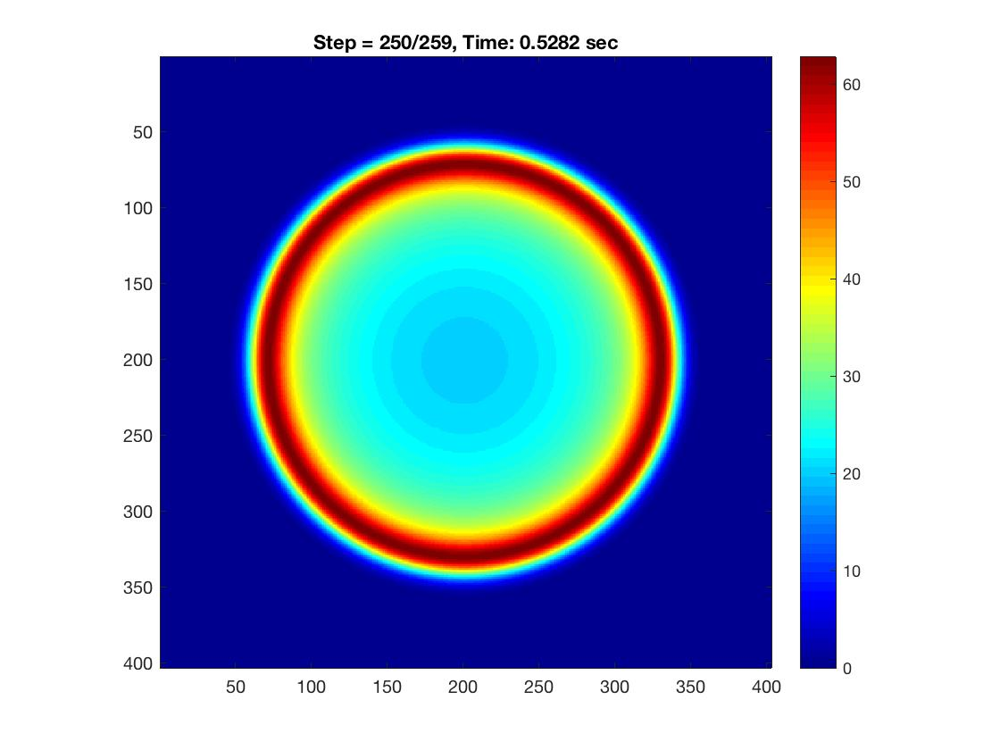

# **Simple FDTD wave propagation in 2D acoustic isotropic medium**

Single-file vectorized implementation of acoustic wave propagation in MATLAB. The program is solving second-order wave equation in pressure formulation. Modelling area is surrounded by simple absorbing sponge boundaries with exponential decay (Cerjan, 1985). 

### **DISCRETIZATION DETAILS**:
* Finite-Differences in Time Domain (FDTD)
* Explicit time stepping
* O(2,2)
* Conventional stencils derived from Taylor series: 
    * in space [1: -2 :1]/dx2
    * in time [1: -2 :1]/dt2

### **MODEL DETAILS**
* Isotropic (vp)
* Sponge or reflecting boundaries

### **HOW TO USE**: 
Run `acoustic_2D_FDTD_O22.m` in MATLAB

oleg.ovcharenko@kaust.edu.sa

vladimir.kazei@kaust.edu.sa
